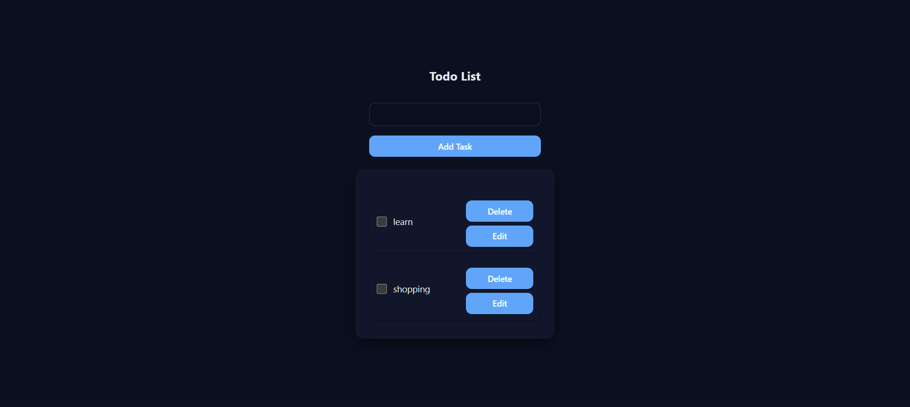

# 📝 To‑Do App — MERN + TypeScript

A full‑stack to‑do application built with **MongoDB, Express, React (Vite) + TypeScript**, and **Node.js**. Create, read, update, and delete tasks with a clean UI and a simple REST API.

---

## 📸 Screenshot



---

## ✨ Features

* Add, toggle complete, edit, and delete tasks
* Strongly‑typed React (TypeScript) frontend
* REST API backend with MongoDB
* Clean, modular project structure
* Ready for deployment

---

## 🧰 Tech Stack

* **Frontend**: React 18, Vite, TypeScript, CSS
* **Backend**: Node.js, Express
* **Database**: MongoDB

---

## 📁 Project Structure

```
TO-DO-APP/
├─ backend/
│  ├─ models/
│  ├─ routes/
│  ├─ package.json
│  └─ server.js
└─ frontend/
   ├─ public/
   └─ src/
      ├─ assets/
      ├─ components/
      ├─ App.tsx
      ├─ App.css
      ├─ index.css
      └─ main.tsx
```

---

## ⚙️ Prerequisites

* Node.js ≥ 18
* npm ≥ 9
* MongoDB instance (Atlas or local)

---


## 🔌 API Overview

* **GET /api/tasks** → List all tasks
* **POST /api/tasks** → Create a task
* **PATCH /api/tasks/\:id** → Update a task
* **DELETE /api/tasks/\:id** → Delete a task

---

